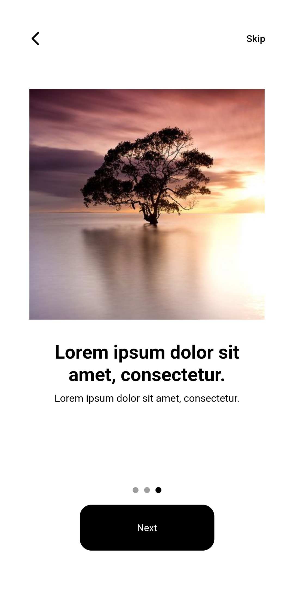
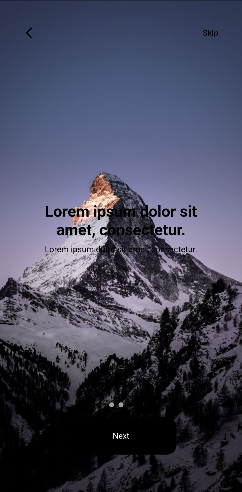

# deploy token 
```yaml 
deploy token: gitlab+deploy-token-1222290
password: sf74FsZY17X5WhQVu5GJ
```

# onboarding-package

### ADD THIS TO YOU'RE MAIN

```dart
GetIt.instance.registerSingleton<AppTheme>(AppTheme());
final appTheme = GetIt.instance<AppTheme>();
```

### IF U WAN'T TO CHANGE SOME THEME

```dart
    appTheme.addTheme(
      "onboarding",
      OnboardingThemeData(
        titleTextStyle: TextStyle(
            color: Colors.black,
            fontSize: sp(24),
            fontWeight: FontWeight.w700
        )
        subtitleTextStyle: TextStyle(
          color: Colors.black,
          fontSize: sp(13),
          fontWeight: FontWeight.w400
        ),
        ctaNextButtonThemeData: CtaThemeData(
          backgroundColor: Colors.black,
          textButtonStyle: TextStyle(
            color: Colors.white)
        ),
        backgroundClr: Colors.white,
        skipButtonTextClr: Colors.black,
        activeDotViewIndicatorClr: Colors.black,
        dotsViewIndicatorClr: Colors.grey,
      ),
    );
```

## Usage

### OnboardingModel
You can replace title by your own widget in titleChild (title need to be null)

You can replace urlpath by your own widget in imageChild (urlpath need to be null)

#### OnboardingType.center

Set type to OnboardingType.center for little image on top of the title

```dart
    return Scaffold(
      body: OnboardingWidget(
        canGoBack: true,
        type: OnboardingType.center,
        pages: [
          OnboardingModel(
            urlpath: "image url",
            title: "Lorem ipsum dolor sit amet, consectetur.",
            subtitle: "Lorem ipsum dolor sit amet, consectetur.",
          ),
          OnboardingModel(
            urlpath: "image url",
            title: "Lorem ipsum dolor sit amet, consectetur.",
            subtitle: "Lorem ipsum dolor sit amet, consectetur.",
          ),
          OnboardingModel(
            urlpath: "image url",
            title: "Lorem ipsum dolor sit amet, consectetur.",
            subtitle: "Lorem ipsum dolor sit amet, consectetur.",
          ),
        ],
      ),
    );
```



#### OnboardingType.fullscreen

Set type to OnboardingType.fullscreen for background image

Fill the fullscreenBackgroundBuilder with index corresponding to the page

No urlpath in OnboardingModel when OnboardingType.fullscreen

```dart
    return Scaffold(
      body: OnboardingWidget(
        canGoBack: true,
        type: OnboardingType.fullscreen,
        fullscreenBackgroundBuilder: ((context, index) {
          if (index == 0) {
            return AnimatedContainer(duration: Duration(milliseconds: 300), width: double.infinity, height: double.infinity, decoration: BoxDecoration(image: DecorationImage(image: NetworkImage("image url"), fit: BoxFit.cover)));
          } else if (index == 1) {
            return AnimatedContainer(duration: Duration(milliseconds: 300), width: double.infinity, height: double.infinity, decoration: BoxDecoration(image: DecorationImage(image: NetworkImage("image url"), fit: BoxFit.cover)));
          } else {
            return AnimatedContainer(duration: Duration(milliseconds: 300), width: double.infinity, height: double.infinity, decoration: BoxDecoration(image: DecorationImage(image: NetworkImage("image url"), fit: BoxFit.cover)));
          }
        }),
        pages: [
          OnboardingModel(
            title: "Lorem ipsum dolor sit amet, consectetur.",
            subtitle: "Lorem ipsum dolor sit amet, consectetur.",
          ),
          OnboardingModel(
            title: "Lorem ipsum dolor sit amet, consectetur.",
            subtitle: "Lorem ipsum dolor sit amet, consectetur.",
          ),
          OnboardingModel(
            title: "Lorem ipsum dolor sit amet, consectetur.",
            subtitle: "Lorem ipsum dolor sit amet, consectetur.",
          ),
        ],
      ),
    );
```

